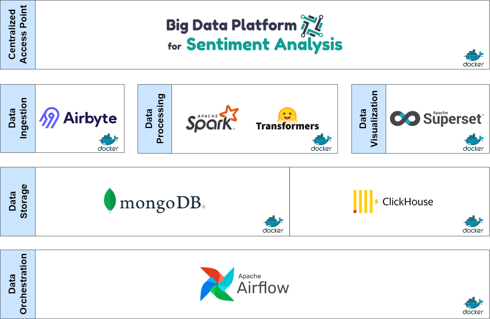

<div align="center">
    
</div>

<h3 align="center">
    <br><b>Author</b>
    <br>Liviu Viorel Jula
    <br>
    <br><b>Tutor</b>
    <br>Dr. Álvar Arnaiz González
</h3>

<br><br>

# Introduction

This project focuses on building a Big Data Platform for Sentiment Analysis completely scalable, dockerized and modular. The following diagram describes the technologies used in the architecture of the platform:

<div align="center">
    
</div>


# Installation guide

This process will take some time since all the services need to be deployed and configured first.

1. Create Python virtual environment and activate it.

    ```sh
    python3 -v venv .venv
    source .venv/bin/activate
    ```

2. Install [requirements.txt](./requirements.txt).

    ```sh
    pip install -r requirements.txt
    ```

2. Run [quickstart.sh](quickstart.sh).

    ```sh
    ./quickstart.sh
    ```

This script will deploy and configure all the components in the platform with a demo dataset. For more information, please check the documentation.

A graceful minute will be given to Airbyte after it's up and running to let it boot up properly before configuring it further.